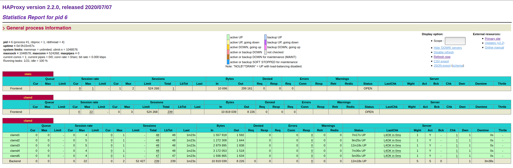

# Running clamd in docker containers
This is a proof of concept to run multiple docker clamd instances managed by haproxy.

## About
This repository provides a simple docker compose file which includes a clamd
service and a haproxy service. The haproxy configuration is located in
`./etc/haproxy/haproxy.cfg`. The haproxy configuration uses a server-template
for the clamd instances.

```
  server-template clamd 5 clamd:3310 check resolvers docker resolve-prefer ipv4
```

Haproxy uses the internal docker DNS service to resolve the clamd service
alias. The DNS service uses already roundrobin for containers with the same
network alias.

```
$ docker exec -ti docker-clamav-haproxy_clamd_1 host clamd
clamd has address 192.168.32.2
clamd has address 192.168.32.7
clamd has address 192.168.32.6
clamd has address 192.168.32.4
clamd has address 192.168.32.5
$ docker exec -ti docker-clamav-haproxy_clamd_1 host clamd
clamd has address 192.168.32.4
clamd has address 192.168.32.5
clamd has address 192.168.32.7
clamd has address 192.168.32.2
clamd has address 192.168.32.6

```

## Start the test setup
```
sh start.sh -n 5
```

## Usage
```
clamdscan -c clamd.remote.conf --fdpass --stream suspicious/
```

## Remove the test setup
```
sh destroy.sh
```
